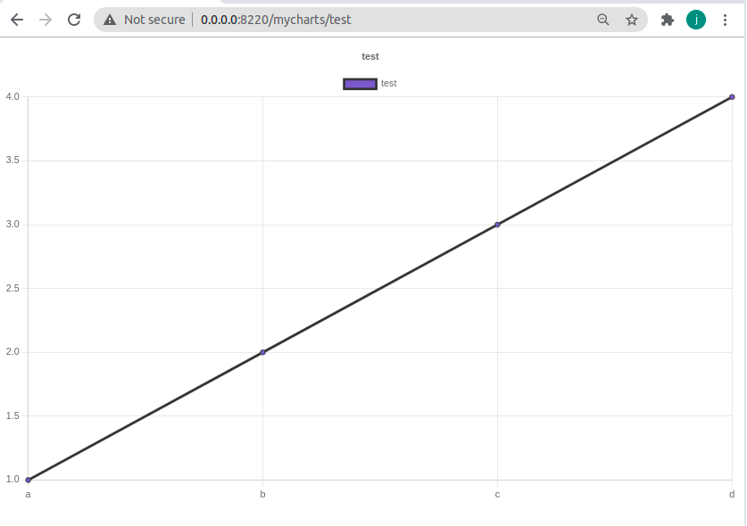
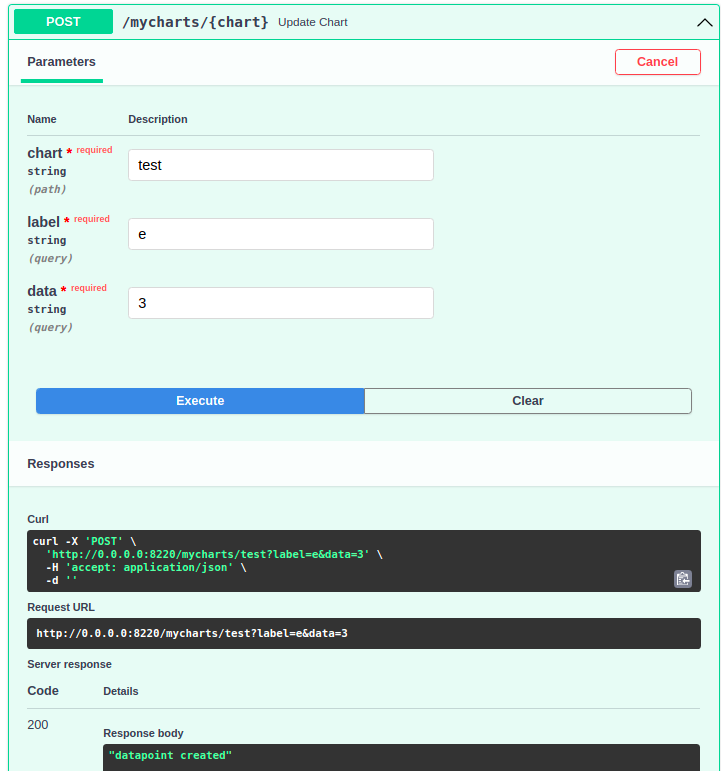
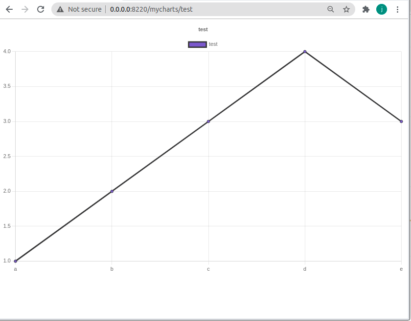
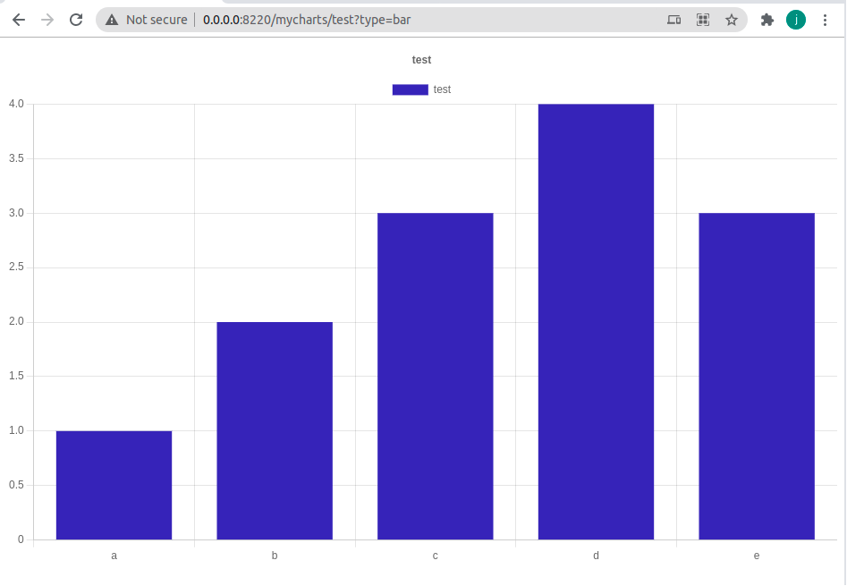
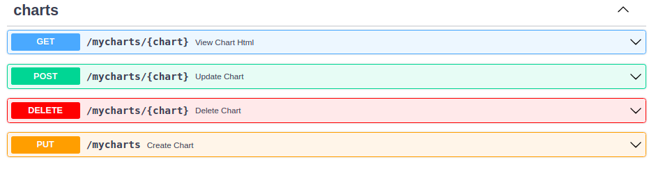
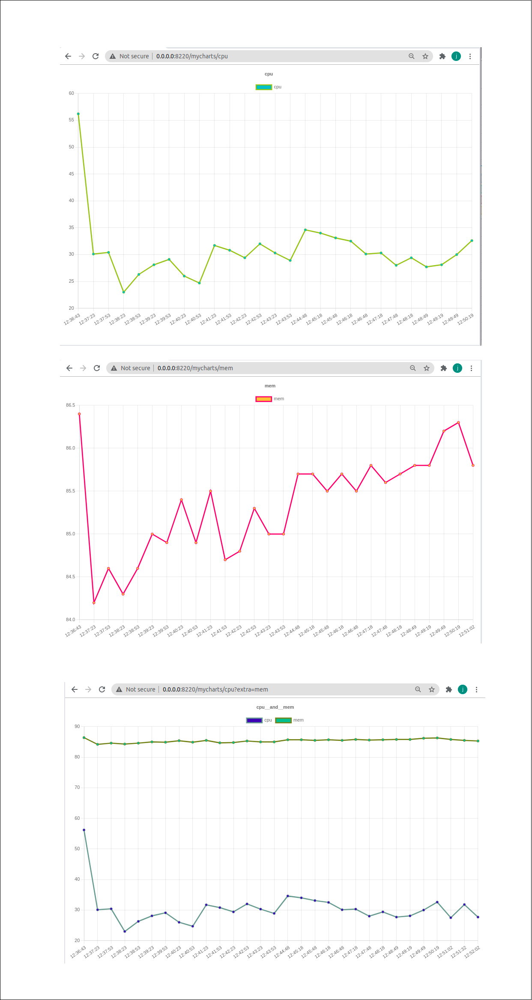

##

Easily create data visualization of static or streaming data


## Get Started

```python
pip install easycharts
```

## Create EasyCharts Server

```python
# charts.py
from fastapi import FastAPI
from easycharts import ChartServer

server = FastAPI()

@server.on_event('startup')
async def setup():
    server.charts = await ChartServer.create(
        server,
        charts_db="test"
    )

    await server.charts.create_dataset(
        "test",
        labels=['a', 'b', 'c', 'd'],
        dataset=[1,2,3,4]
    )
```
## Start Server

```bash
uvicorn --host 0.0.0.0 --port 0.0.0.0 charts:server

```



## Update Data via API

In a separate window, access the OpenAPI docs to demonstrate dynanimc updates to the graph

```
http://0.0.0.0:8220/docs
```

 

## Line



## Bar


## APIS



## Real World Usage - Resource Monitoring


```python
import datetime, psutil
import asyncio
from fastapi import FastAPI
from easycharts import ChartServer
from easyschedule import EasyScheduler

scheduler = EasyScheduler()
server = FastAPI()

every_minute = '* * * * *'

@server.on_event('startup')
async def setup():
    asyncio.create_task(scheduler.start())
    server.charts = await ChartServer.create(
        server,
        charts_db="charts_database",
        chart_prefix = '/mycharts'
    )

    await server.charts.create_dataset(
        "test",
        labels=['a', 'b', 'c', 'd'],
        dataset=[1,2,3,4]
    )

    # set initial sync time
    label=datetime.datetime.now().isoformat()[11:19]
    await server.charts.create_dataset(
        'cpu',
        labels=[label],
        dataset=[psutil.cpu_percent()]
    )
    await server.charts.create_dataset(
        'mem',
        labels=[label],
        dataset=[psutil.virtual_memory().percent]
    )

    @scheduler(schedule=every_minute)
    async def resource_monitor():
        time_now=datetime.datetime.now().isoformat()[11:19]

        # updates CPU & MEM datasets with current time
        await server.charts.update_dataset(
            'cpu',
            label=time_now,
            data=psutil.cpu_percent()
        )
        await server.charts.update_dataset(
            'mem',
            label=time_now,
            data=psutil.virtual_memory().percent
        )
```

